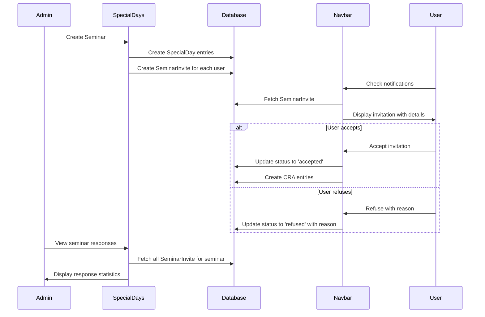

# Seminar Creation Logic - Architecture Plan

## Overview
This document outlines the implementation plan for enhancing the seminar creation feature in the CRA application. The enhancement allows administrators to create seminars with detailed information (location, activities, details) and track user responses (accept/refuse with justification).

## Data Model Changes

### 1. Extend SeminarInvite Model
Update the `SeminarInvite` model in `amplify/data/resource.ts`:

```typescript
SeminarInvite: a.model({
  startDate: a.string().required(),
  endDate: a.string().required(),
  title: a.string(),
  message: a.string(),
  // New fields for seminar details
  location: a.string(),        // Seminar location
  activities: a.string(),      // Activities description (could be JSON string for structured data)
  details: a.string(),         // Additional details about the seminar
  refuseReason: a.string(),    // User's justification when refusing
  // Existing fields
  status: a.enum(['pending','accepted','refused']),
  userRead: a.boolean().default(false),
  userHidden: a.boolean().default(false),
})
```

## UI/UX Flow

### Administrator Flow
1. **Create Seminar** (Special Days Page)
   - Admin navigates to Administration → Jours spéciaux
   - Selects "Séminaire" type
   - Fills in:
     - Date range (start/end)
     - Location
     - Activities
     - Details
     - Scope (global/user)
   - Clicks "Ajouter"
   - System creates SpecialDay entries and SeminarInvite for all affected users

2. **View Responses** (Special Days Page)
   - Admin sees seminars with response indicators
   - Can click on a seminar to view detailed statistics
   - Modal shows:
     - Total invitations sent
     - Accepted count with user list
     - Refused count with user list and reasons
     - Pending count with user list

### User Flow
1. **Receive Notification**
   - User sees notification badge in navbar
   - Opens inbox to view seminar invitation
   - Sees seminar details (dates, location, activities, details)

2. **Respond to Invitation**
   - Accept: Creates CRA entries automatically for seminar days
   - Refuse: Shows input field for justification (optional)
   - Updates status and removes from pending notifications

## Implementation Details

### 1. Special Days Page Enhancement (`app/admin/special-days/page.tsx`)

#### Add Seminar Detail Fields
```typescript
// Add to state
const [semLocation, setSemLocation] = useState<string>('');
const [semActivities, setSemActivities] = useState<string>('');
const [semDetails, setSemDetails] = useState<string>('');

// Add to form when type === 'seminaire'
<TextField
  size="small"
  label="Lieu"
  value={semLocation}
  onChange={(e) => setSemLocation(e.target.value)}
  fullWidth
/>
<TextField
  size="small"
  label="Activités"
  value={semActivities}
  onChange={(e) => setSemActivities(e.target.value)}
  multiline
  rows={2}
  fullWidth
/>
<TextField
  size="small"
  label="Détails"
  value={semDetails}
  onChange={(e) => setSemDetails(e.target.value)}
  multiline
  rows={3}
  fullWidth
/>
```

#### Add Response Tracking Dialog
```typescript
// Add state for response tracking
const [responseDialog, setResponseDialog] = useState<{
  open: boolean;
  seminarKey: string;
  responses: Array<{
    userId: string;
    status: 'pending' | 'accepted' | 'refused';
    refuseReason?: string;
  }>;
}>({ open: false, seminarKey: '', responses: [] });

// Function to fetch seminar responses
const fetchSeminarResponses = async (startDate: string, endDate: string) => {
  const { data } = await client.models.SeminarInvite.list({
    filter: {
      startDate: { eq: startDate },
      endDate: { eq: endDate }
    }
  });
  // Process and return response data
};
```

### 2. Navbar Component Enhancement (`components/Navbar.tsx`)

#### Add Refuse Reason Dialog
```typescript
// Add state for refuse reason
const [refuseDialog, setRefuseDialog] = useState<{
  open: boolean;
  inviteId: string;
  reason: string;
}>({ open: false, inviteId: '', reason: '' });

// Update refuse button to show dialog
<Button
  onClick={() => setRefuseDialog({ 
    open: true, 
    inviteId: inv.id, 
    reason: '' 
  })}
>
  Refuser
</Button>

// Add refuse reason dialog
<Dialog open={refuseDialog.open} onClose={() => setRefuseDialog({ open: false, inviteId: '', reason: '' })}>
  <DialogTitle>Refuser l'invitation au séminaire</DialogTitle>
  <DialogContent>
    <TextField
      label="Justification (optionnel)"
      value={refuseDialog.reason}
      onChange={(e) => setRefuseDialog(prev => ({ ...prev, reason: e.target.value }))}
      multiline
      rows={3}
      fullWidth
      margin="normal"
    />
  </DialogContent>
  <DialogActions>
    <Button onClick={() => setRefuseDialog({ open: false, inviteId: '', reason: '' })}>
      Annuler
    </Button>
    <Button 
      color="error" 
      variant="contained"
      onClick={async () => {
        // Update invite with refused status and reason
        await client.models.SeminarInvite.update({
          id: refuseDialog.inviteId,
          status: 'refused',
          refuseReason: refuseDialog.reason,
          userRead: true
        });
        // Update UI and close dialog
      }}
    >
      Confirmer le refus
    </Button>
  </DialogActions>
</Dialog>
```

## Sequence Diagram



## Key Features

### 1. Enhanced Seminar Creation
- Location field for venue information
- Activities field for describing seminar activities
- Details field for additional information
- All fields are included in the SeminarInvite sent to users

### 2. User Response Tracking
- Real-time tracking of acceptance/refusal
- Justification capture for refusals
- Visual indicators in admin interface

### 3. Automatic CRA Integration
- Accepting a seminar automatically creates CRA entries
- Days are marked as "Séminaire" category with value 1
- CRA status updated to 'saved'

### 4. Admin Dashboard
- View acceptance rate
- See list of users by response status
- Access refusal reasons for insights

## Testing Scenarios

1. **Create Seminar**
   - Create global seminar with all details
   - Create user-specific seminar
   - Verify SeminarInvite created for all affected users

2. **User Acceptance**
   - User accepts invitation
   - Verify CRA entries created
   - Verify notification removed

3. **User Refusal**
   - User refuses with justification
   - Verify reason saved
   - Verify admin can view reason

4. **Response Tracking**
   - Admin views response statistics
   - Verify counts are accurate
   - Verify user lists are correct

## Security Considerations

- Only admins can create seminars
- Users can only view/respond to their own invitations
- Authorization rules enforce data isolation
- Audit trail maintained through owner field

## Future Enhancements

1. **Email Notifications**
   - Send email when seminar is created
   - Reminder emails for pending invitations

2. **Attachment Support**
   - Allow admins to attach documents to seminars
   - Store in Amplify Storage

3. **Recurring Seminars**
   - Support for recurring seminar patterns
   - Bulk management tools

4. **Export Functionality**
   - Export response data to Excel
   - Generate attendance reports